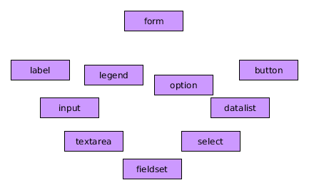
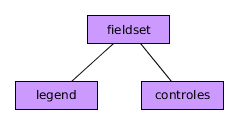

## Formularios en HTML

Los formularios son otros de los elementos que se han asociado desde siempre a las páginas webs. Los hemos usado tanto que es difícil calcular cuántos formularios habremos rellenado a lo largo de nuestra larga vida (al menos la mía) como usuario de la web.

Formularios de registro, usuario y contraseña, solicitudes etc... son contextos en los que los podemos encontrar.

De un modo más formal podemos decir lo siguiente:

- Los formularios son elementos, que como los enlaces, permiten una interacción del usuario con la página web.
- Su tarea principal es recoger información. El usuario, por tanto, debe introducir esa información en los campos del formulario.
- Una vez se ha recogido esa información el formulario la enviará al servidor, por correo o donde decida el programador para ser tratada, mostrada y/o almacenada.

### Estructura del formulario

En un formulario nos podemos encontrar con muchos elementos.



El más importante de todo es el elemento padre, la etiqueta **<form>** que va a contener en su interior todos los elementos que conformen nuestros formularios.

Esta etiqueta puede tener varios atributos de entre los que destacamos:

- **method** que indica cómo se va a pasar la información al destino. Puede ser por GET (se ve la información en la barra del navegador) y por POST ( no se ve y es la opción por defecto).
- **action** que indica el destino de nuestros datos. Normalmente será una URL o dirección de Internet. Existen más opciones. Os invito a visitar la documentación de referencia.

A continuación vamos a ver algunos de los elementos más frecuentes y a describir su estructura y funcionamiento.

### Labels e Input

Normalmente para la recogida de información los formularios usando etiquetas **<input>**. Pero, para poder saber qué campos estamos rellenando una buena práctica (se puede de otras maneras menos elegantes) es poner una etiqueta **<label>** (etiqueta)delante de cada input para dar nombre y asociar ambas.

Un ejemplo sería:

```html
<label for="nombre">Nombre:</label>
<input type="text" name="nombre" />
```

Aquí estamos asociando la etiqueta al campo usando los atributos **_for_** y **_name_**.

El campo que hemos usado para la recogida de información es un input. Existen muchos tipos que veremos con más detalle en el próximo apartado.

### Listas desplegables

Son elementos que también hemos visto muchas veces. Al hacer click sobre ellos nos muestran varias opciones de las que podremos escoger una o varias.

Para crear listas desplegables usaremos las etiquetas **<select>** como etiqueta padre y una etiqueta **<option>** para cada una de las opciones que tengamos en la lista desplegable. Si queremos agrupar esas opciones las meteremos a su vez dentro de una etiqueta **<optgroup>**.

Un ejemplo sería:

```html
<select name="provincia">
    <optgroup label="Aragon">
        <option value="Z">Zaragoza</option>
        <option>Huesca</option>
        <option selected>Teruel</option>
    </optgroup>

</select>
```

Fijaros los nuevos atributos que he metido.

### Áreas de Texto

Son campos de formulario para meter texto largos. Tienen dos atributos interesantes.

- **rows:** para indicar el número de filas que tiene el campo.
- **cols:** para indicar el número de columnas que tiene el campo.

Un ejemplo sería:

```html
<textarea cols="10" rows="10">
    Lorem ipsum dolor sit amet consectetur adipisicing elit. Cumque voluptate corrupti ut earum, aliquam sint amet repellendus, vitae placeat repellat quis, ipsa qui. Velit placeat reiciendis tempore autem nostrum eaque?
</textarea>
```

### Botones

La etiqueta **<button>** no creo que se necesario explicar para que sirve...Haz click!!!

El atributo más importante que tienen es type que puede tomar tres valores:

- **button:** se comporta como un botón que puede estar presionado o no. Nada especial.
- **reset:** al hacer click borra todos los datos introducidos previamente en el formulario y pone los valores por defecto.
- **submit:** al hacer click envía los datos introducidos al destino que hemos puesto en el action del formulario.

### Agrupando atributos

Hay situaciones en las que los campos de los formularios por significado, por importancia o por cualquier razón, queremos que se muestren agrupados. Para estos casos tenemos la etiqueta **<fieldset>** que la usaremos siguiente el siguiente esquema:



Siendo:

- **<legend>** una etiqueta que contiene el nombre del grupo y que se mostrará en la parte de arriba.
- **controles** todos los campos que queramos meter.

**NOTA:** la etiqueta tiene un borde por defecto

Un ejemplo sería:

```html
<fieldset>
    <legend>Datos Personales</legend>
    <p>
        <label for="nombre">Nombre:</label>
        <input type="text" name="nombre" placeholder="Inserta Nombre" required />
    </p>
    <p>
        <label for="apellidos">Apellidos:</label>
        <input type="text" name="apellidos" value="Pérez" readonly />
    </p>

    <p>
        <label for="provincia">Provincia</label>
        <select name="provincia">
            <optgroup label="Aragon">
                <option value="Z">Zaragoza</option>
                <option>Huesca</option>
                <option selected>Teruel</option>
            </optgroup>

        </select>
    </p>

    <p>
        <input type="submit" value="Enviar" />
    </p>
</fieldset>
```

### Atributos interesantes de los elementos de los formularios

Además existen una serie de atributos interesantes que podemos añadir a los controles o elementos de los formularios:

- **required** que indica que un control es obligatorio de rellenar.
- **disabled** que mostrará el elemento como deshabilitado.
- **readonly** que nos dice que el campo es de sólo lectura.
- **placeholder** que muestra un mensaje en los input dando pistas de lo que debemos poner. Al empezar a rellenarlo desaparece.
- **selected** indica la opción seleccionada.
- **value** el valor que tiene el elemento..
- **tabindex** para asegurarnos que podemos navegar por los elementos usando el tabulador podemos establecer un orden para cada uno.
- **multiple** para seleccionar varias opciones en una lista desplegable.
- Y muchos más...
